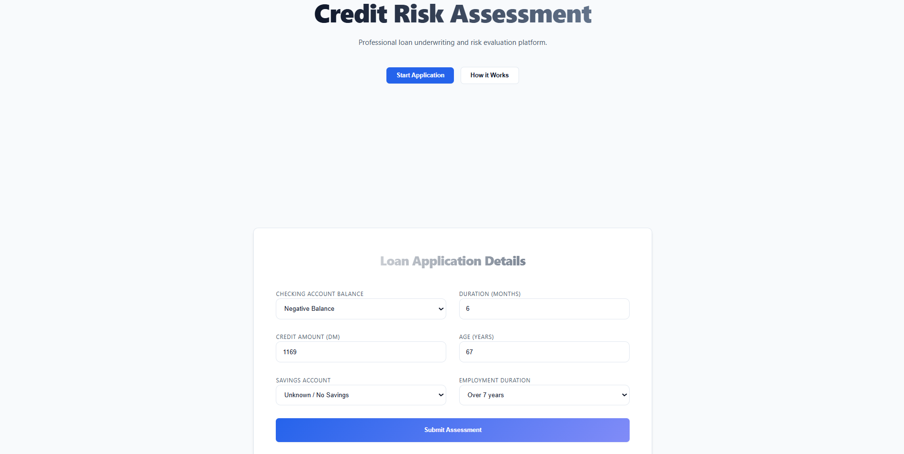
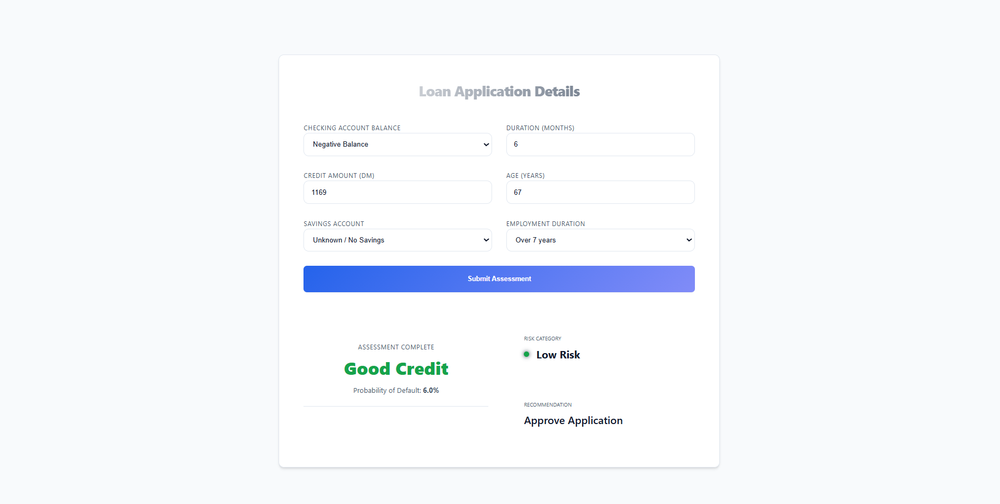

# Credit Risk Assessment System


A professional machine learning application designed to automate credit risk evaluation for loan applicants. This system combines a robust **Random Forest** classification engine with a modern, high-performance web interface to provide real-time underwriting decisions.

## Key Features

*   **Real-Time Risk Scoring**: Instant assessment of creditworthiness using 20+ financial and demographic indicators.
*   **Production-Grade Pipeline**: End-to-end `scikit-learn` pipeline handling data preprocessing, encoding, and scaling automatically.
*   **Professional UI**: A clean, "FinTech-ready" user interface built with **React** and **Vite**, featuring responsive design and clear decision visualization.
*   **RESTful API**: A documented **FastAPI** backend that serves the model, ready for integration with other banking systems.
*   **Decision Transparency**: Provides not just a binary "Approve/Reject" decision, but also a probability score and risk categorization (Low/Medium/High).

## Live Demo

*   **Frontend Application**: [https://credit-scoring-ml-system.vercel.app/](https://credit-scoring-ml-system.vercel.app/)
*   **API Backend**: [https://credit-scoring-ml-system.onrender.com](https://credit-scoring-ml-system.onrender.com)

## System Interface

### Application Dashboard
<!-- Insert Dashboard Screenshot below -->

*Professional input interface for loan applicant details.*

### Risk Assessment Result
<!-- Insert Result Screenshot below -->

*Clear decision visualization with calculated risk probability.*

## Tech Stack

### Backend (Intelligence Layer)
*   **FastAPI**: High-performance web framework for building APIs.
*   **Scikit-Learn**: Machine learning library for model training and pipeline management.
*   **Pandas & NumPy**: Data manipulation and numerical analysis.
*   **Joblib**: Model serialization for efficient loading.

### Frontend (Application Layer)
*   **React (Vite)**: Component-based library for building user interfaces.
*   **CSS Modules**: Modular and scoped styling for a professional look.
*   **Framer Motion**: Smooth animations for enhanced user experience.
*   **Lucide React**: Modern iconography standard.

## Project Structure

```bash
credit-scoring-ml-system/
├── backend/                
│   ├── api.py              
│   ├── main.py             
│   ├── predict.py          
│   └── ...
├── frontend/               
│   ├── src/
│   │   ├── components/     
│   │   ├── services/       
│   │   └── ...
│   └── ...
├── dataset/                
│   └── german.data         
└── outputs/                
    └── credit_scoring_pipeline.pkl  
```

## Quick Start

### Prerequisites
*   Python 3.8 or higher
*   Node.js 16+ and npm

### 1. Backend Setup
Navigate to the root directory and install Python dependencies:
```bash
pip install -r requirements.txt
```

Train the model (this will generate the `.pkl` file):
```bash
python backend/main.py
```

Start the API server:
```bash
uvicorn backend.api:app --reload
```
*The API will be available at `http://127.0.0.1:8000`*

### 2. Frontend Setup
Open a new terminal, navigate to the frontend folder, and install dependencies:
```bash
cd frontend
npm install
```

Run the development server:
```bash
npm run dev
```
*The application will launch at `http://localhost:5173`*

## API Documentation

Once the backend is running, you can access the interactive Swagger UI at:
`http://127.0.0.1:8000/docs`

### Interactive API Docs
<!-- Insert Swagger UI Screenshot below -->


**Endpoint**: `POST /predict`
**Payload Example**:
```json
{
  "Status": "A11",
  "Duration": 12,
  "CreditAmount": 2000,
  "Age": 30,
  ...
}
```

## Model Performance

The model is trained on the standard **German Credit Dataset** (UCI Machine Learning Repository).
*   **Algorithm**: Random Forest Classifier
*   **Accuracy**: ~80%
*   **Precision (Good Credit)**: High precision to minimize financial risk.

## License

This project is licensed under the MIT License - see the LICENSE file for details.
